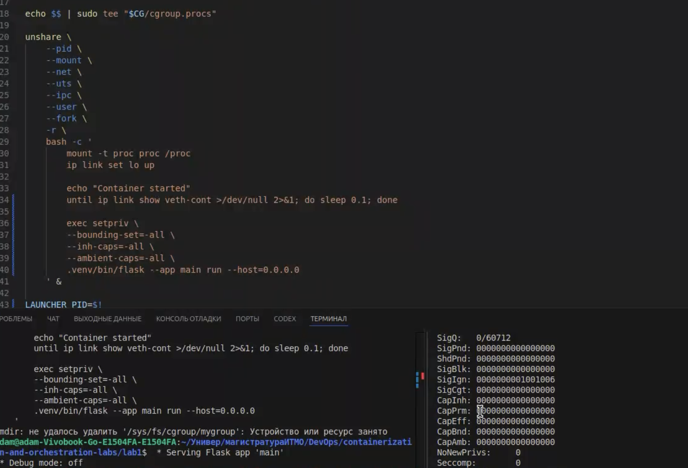
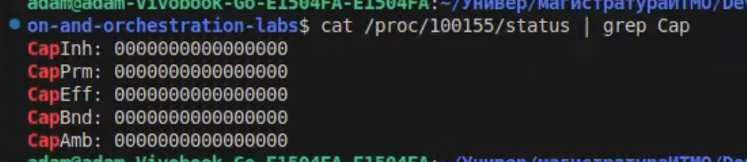
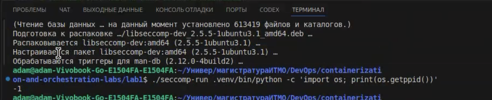
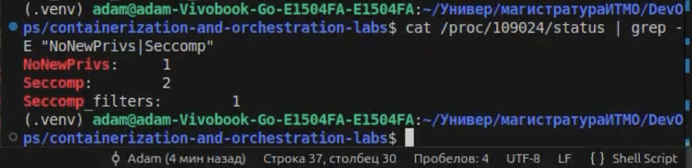
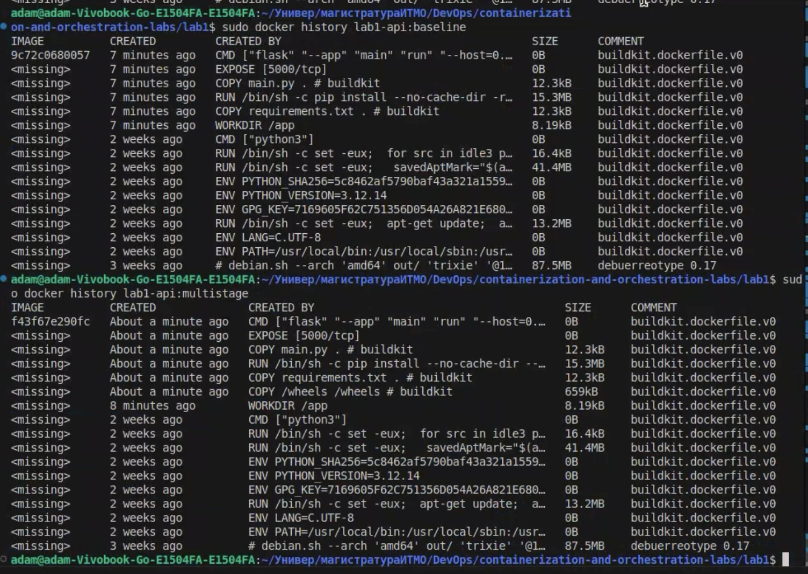
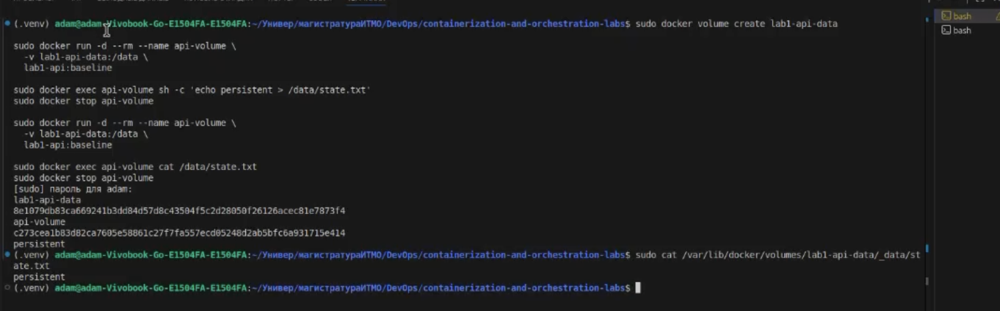
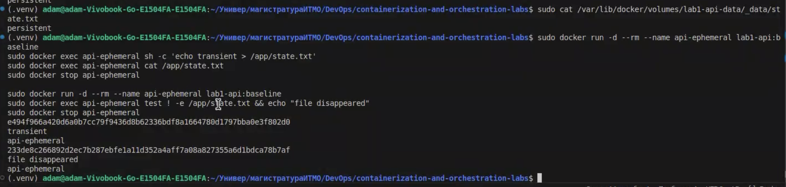

# Lab 1
https://github.com/KeladKaal/containerization-and-orchestration/blob/main-rus/lecture-1-docker/lab.md
## Установка
1. Необходим Python версии 3.xx (https://www.python.org/downloads/)
2. `python3 -m venv .venv`
3. `source .venv/bin/activate`
4. `pip install -r requirements.txt`

## Запуск
1. `flask --app main run`
- `http://127.0.0.1:5000/health`
- `http://127.0.0.1:5000/eat?mb=N`
- `http://127.0.0.1:5000/burn`

## Мониторинг
- Посмотреть потребление ресурсов: `ps -eo pid,vsz,rss,%mem,%cpu,comm | grep [p]ython3` / `top -p $(pgrep -d ',' 'python')`# lab-part1

## Часть 0
Написал минимальный веб-сервис на flask (python):
- Для `GET /eat?mb=N` создаю объект `bytearray(N)` и помещаю в список `memory: list[bytearray]` (так как этот список в global scope, garbage collector не будет очищать его и память будет оставаться занятой на протяжении всей жизни процесса)
- Для `GET /burn` сделал бесконечный цикл с возведением в степень:
```
    while True:
        _ = 1000**1000
```

## Часть 1
1 вывод ps - после /health

2, 3 вывод ps - после /eat?mb=500 (видно что vsz, rss, %mem увеличились)

После 3 вывода ps пошел /burn, Ryzen 5 7520U начал реветь🔥


## Часть 2

Необходимо поместить процесс в свои namespaces через `unshare` (pid, mount, net, uts, ipc и user)

Так как на маке нет namespaces и unshare ( есть только на линуксе ), запушу виртуалку Linux и уже внутри создам свой namespace


Казалось бы ошибка, в выделение памяти, но ядро решило сыграть со мной злую шутку и проблема вовсе не в выделении памяти

Проблема в именно в том, как работает unshare. Он не просто создает новое пространство и помещает туда процесс. Под капотом unshare сначала переносит себя в новые net, uts, ipc, mnt, user, а только потом добавляет процесс и себя удаляет ( и дочерний становится PID = 1 )

**Схема работает так:**

мы создаем новые net, uts, ipc, mnt, user - списки

туда переносим unshare-процесс ( процесс команды, которую мы только что запустили )

Зачем? Почему не оставить пустые списки? Изолированное пространство пустое будет удалено ядром, если туда не добавить какой-то процесс

Поэтому переносим его туда

И тут возникает вопрос, как перенести его в новый список, если мы уже глобально открыли unshare-процесс на хосте при выполнение команды. У него есть свой PID, например, 3001

В Unix запускается программа двумя способами: либо execve() (`exec python main.py` ) процесс выбрасывает свою программу и загружает в себя другую с тем же PID ( PID остаётся прежним - **а** **нам как раз это не надо** ), либо fork() - это когда процесс можно отклонировать с новым PID, а потом например сделать execve(), поменяв содержимое программы. Так работает `python main.py` из консоли. он сначала форкает bash ( создавая его с новым PID ), а потом делает execve() меняя содержимое программы на питон с тем же PID 

Наша задача как раз закинуть unshare-процесс в новый cписок PID (—pid), поменяв его PID с 3001 на PID = 1

Поэтому для этой задачи мы должны форкнуть ( —fork флаг написать ) процесс, чтобы его отклонировать с новым PID в новый список pid


Ура получилось, но почему мы nobody? Дело в том, что —user создает пустую таблицу без юзеров и там ничего нету. Чтобы мы взяли права  root и внесли их в user мапу, можно написать флаг -r


-r в uid_map записывает числа первые два uid внутри ( = 0 ), uid снаружи ( = 501 ) 

И тут возникла еще одна проблема


почему-то когда я попытался вывести список запущенных процессов, у меня вывелись еще и запущенные процессы самого хоста, а не только контейнера

Из интересного видно, что пользователь снаружи nobody и не привелигированный, а мы привелигированные, хотя по факту все наоборот. root внутри - это непривилегированный пользователь снаружи.

Ну, немного покопавшись, я понял, что мы как бы создали новую таблицу монтирований абсолютно пустую. `ps` работает так, что ищет список процессов через специальный интерфейс ядра /proc, притворяющийся деревом каталогов

Иначе говоря, проблема в том, что я не примонтировал /proc в новый mount namespace

/proc у меня всё ещё хостовый, поэтому видит все процессы


ура наконец-то получилось. Видно, что у запущенного процесса bash PID = 1. `ps aux` мы набрали только что, поэтому он запущен. bash сделал `fork()` + `exec("ps")`

а когда ps открыл `/proc`, пошёл по каталогам - и наткнулся там на свой собственный `/proc/12`. Он существует, значит попал в вывод.


Видно, что имя хоста не сменилось и оно свое

Теперь сеть:


Видно, что кроме loopback в режиме DOWN ничего нет, сеть пустая ( в отличие от хоста )

Проверяем


Видно, что снаружи мы уже не root, снаружи выглядим как PID = 4009720, uid = 501 с именем nikx.

## Часть 3

### Сеть и veth

Настраиваем сеть, чтобы была связь с хостом, для этого мы выполнили команду `unshare` и отправили её в фон через `sleep infinity`


Запускаем пространство и узнаём PID `unshare`

```bash
PID=$!
```

Затем создали virtual ethernet пару

```bash
sudo ip link add veth-host type veth peer name veth-cont
```

`veth` - виртуальный патч-корд с двумя концами. Всё, что влетает в один конец, вылетает из другого. Создаются **оба конца сразу** и оба пока на хосте.

```bash
sudo ip link set veth-cont netns "$PID"
```

далее перенесли один конец в network namespace контейнер

`nsenter` позволяет запускать команды в чужом пространстве имён

далее выполняем команды и настраиваем namespace через `nsenter`


Далее запускаем `flask` на 5000 порте

делаем запрос на 10.0.0.2


то есть на адрес контейнера, а не хоста

### Создание cgroup и лимиты

Далее мы создаем псевдодиректорию cgroup для своего контейнера и далее можем повесить ограничения на процессы memory.max, cpu.max, pids.max

Получаем PID нашего контейнера


`$$` - берёт текущий процесс (то бишь процесс текущего терминала - bash)

`tee` - читает и сразу записывает

```bash
echo $$ | sudo tee /sys/fs/cgroup/mygroup/cgroup.procs
```


навешиваем ограничения

- `pids.max`: максимум 10 процессов
- `cpu.max`: на каждые 100 000 микросекунд приходится 10 000 микросекунд для процессов cgroup
- `memory.max`: возьмём 5 мегабайт


### Память и OOM

Запускаем и видно, что когда обращаемся по ручке и съедаем 10 мегабайт, то через `ps` видно, что память съело ровно на столько


но мы столкнулись с проблемой, что `flask` жил отдельной жизнью и не наследовал cgroup процесса `unshare`

Чтобы это исправить нам пришлось переделать основной скрипт и сделать так:

1. Запускаем отдельный процесс.
2. СНАЧАЛА помещаем его в cgroup,
3. ПОТОМ он делает `exec unshare`.
4. И потом Flask кладём и запускаем в `unshare`

Flask запускается отсюда, поэтому наследует cgroup.

После нескольких неудачных попыток мы смогли убить этот процесс и вызвать OOMKilled, но что то все равно шло не так


Создали cgroup /sys/fs/cgroup/mygroup и выставили потолок: `memory.max = 104857600`

Первая попытка - убийства не случилось. Дёргали `/eat?mb=50`, затем `/eat?mb=100`. Сервис продолжал отвечать, OOM не срабатывал. При этом `memory.current` упирался ровно в `104857600` байт - байт в байт в `memory.max` - и дальше не рос.

Почему: `memory.max` ограничивает только оперативную память, а `memory.swap.max` по умолчанию не ограничен. Дойдя до потолка, ядро не убивает процесс сразу, а сначала пытается освободить память внутри группы:

- выбрасывает чистые файловые страницы (код `python3`, разделяемые библиотеки) - они подкреплены файлами на диске и при необходимости перечитываются оттуда
- выгружает анонимные страницы в своп.

Лимит формально соблюдён, процесс жив - просто работает медленнее.

Это видно по тому, что `RSS` в `ps` не только рос, но и проседал: с 111300 КБ до 108356 КБ. Своп при этом не отнимает память у соседних процессов - это страницы самой группы, уехавшие на диск.

Побочный вывод: мелкими порциями (`/eat?mb=1`) убийства не добиться вообще - реклейм успевает освобождать столько же, сколько мы просим. Нужен один крупный запрос, который обгонит реклейм.

мы выставили

```bash
echo 0 | sudo tee /sys/fs/cgroup/mygroup/memory.swap.max
```

Теперь при нехватке RAM ядру отступать некуда. Запрос `/eat?mb=100` поверх 15 МБ базового потребления вышел за 100 МиБ, и сработал OOM-killer:


### CPU и throttling

Дальше мы пытались вызвать throttling

**Поля** (все в микросекундах, накопительные с момента создания группы):

- `usage_usec` - сколько процессорного времени группа реально получила
- `user_usec` - из них в user space (остальное `system_usec`, в ядре)
- `throttled_usec` - сколько времени группу принудительно держали без CPU, потому что квота на период уже была выбрана


Если взять разницу между usage 1108514 и следующим 1207838 и разницу между throttled 10844586, 11755904

```
99324 / (99324 + 911318) = 0.098 ≈ 9.8%
```

наш `cpu.max` - `10000 100000`, то есть 10000/100000 максимум **10% ядра**. Следующая пара даёт 99340 против 901024 - те же 9.9%. И большой скачок в конце: 1079822 против 9805529 - снова 9.9%.

### pids и форк-бомба

Далее смотрим работает ли лимит на количество работающих процессов запустив fork-бомбу

Замер до загрузки:


Запускаем форк-бомбу внутри cgroup в самом скрипте

```bash
stress-ng --fork 100 --timeout 10s
```

Замер под нагрузкой


`pids.current` замер ровно на 10 - это в точности `pids.max`, и выше он не поднимется никогда.

За несколько секунд он вырос с 302 до 687 и продолжал расти, пока работала stress-ng. Это не число процессов, а число отбитых попыток их создать.

## Часть 4

Последний шаг `mydocker.sh` срезает все привилегии и отдаёт управление сервису,
который становится PID 1 внутри контейнера:

```bash
exec setpriv \
    --bounding-set=-all \
    --inh-caps=-all \
    --ambient-caps=-all \
    .venv/bin/flask --app main run --host=0.0.0.0
```

Что даёт каждый флаг:

- `--bounding-set=-all` — процесс уже никогда не сможет получить эти capabilities обратно;
- `--inh-caps=-all` — детям ничего не передаётся;
- `--ambient-caps=-all` — не-root процессы не наследуют capabilities при exec.

Втроём они дают гарантию: ни сам сервис, ни что-либо, что он запустит, привилегий не получит.



Вот сброшенные capabilities



Далее мы повесили ограничение на системные вызовы

мы вообще не вкурили как правильно ограничить их, поэтому решили написать ИИшке, чтобы он сделал  лаунчер seccomp-run.c, который устанавливает seccomp профиль

и запускаем 



лаунчер seccomp-run.c навешивает seccomp-профиль на процесс. Вывод получился -1

В профиле на syscall getppid стоит правило типа SCMP_ACT_ERRNO(EPERM): ядро не выполняет вызов, а сразу возвращает ошибку. Обычный getppid() не может завершиться неудачей никогда, поэтому Python даже не проверяет errno и печатает сырое возвращённое значение -1

Вот подверждение, что seccomp реально висит на процессе

Мы прочитали /proc/109024/status

Побочно это ещё и обязательное условие: без CAP_SYS_ADMIN навесить seccomp-фильтр можно только с этим битом.

NoNewPrivs: 1 Процесс и его потомки больше не могут повысить привилегии через setuid-бинарники
Ровно 1 фильтр-программа




## Часть 5 


Всё, что выше мы собирали руками из отдельных утилит, Docker прячет за одной командой

Делаем запуск docker run

```bash
sudo docker run --rm --name api-docker \
  --memory=100m \
  --cpus=0.1 \
  --pids-limit=10 \
  --cap-drop=ALL \
  --security-opt no-new-privileges \
  -p 127.0.0.1:5000:5000 \
  -v "$PWD":/app:ro \
  -w /app \
  python:3.12-slim \
  sh -c 'pip install --no-cache-dir -r requirements.txt && flask --app main run --host=0.0.0.0'
```

`docker run`. Ниже - построчное сопоставление наших шагов с тем, что делает сам Docker:

| Аспект          | `mydocker.sh`                         | Docker                                                              |
|-----------------|---------------------------------------|---------------------------------------------------------------------|
| Namespaces      | `unshare` вручную                     | OCI runtime создаёт автоматически                                   |
| Лимиты          | запись в файлы cgroup v2              | Docker создаёт и настраивает cgroup                                 |
| Capabilities    | `setpriv`                             | `--cap-drop=ALL`                                                    |
| Seccomp         | наш `seccomp-run` блокирует `getppid` | стандартный профиль Docker, другой набор правил                     |
| Сеть            | ручной `veth` и IP                    | bridge, NAT, DNS и port mapping                                     |
| Root filesystem | использует FS хоста                   | image layers, overlay filesystem, mount setup                       |
| Lifecycle       | наш `trap cleanup`                    | `runc`/daemon управляют PID, сигналами, логами и удалением ресурсов |


Архитектурное сравнение:


По сути `mydocker.sh` — это ручная сборка тех же примитивов ядра: namespaces, cgroups,
capabilities и seccomp. Docker добавляет к ним образы, сеть и управление жизненным циклом.

## Часть 6

### что реально лежит в слоях

Собрали из одного и того же приложения два образа - `lab1-api:baseline` (обычный
Dockerfile) и `lab1-api:multistage` (зависимости собираются в отдельной builder-стадии) -
и сравнили их послойно:

```bash
sudo docker history lab1-api:baseline
sudo docker history lab1-api:multistage
```

На скриншоте два вывода подряд: сверху `baseline`, снизу `multistage`. Нижние восемь строк
у обоих совпадают - это база `python:3.12-slim`: rootfs от debuerreotype 87.5 MB, apt-слои
41.4 MB и 13.2 MB, слой сборки Python 16.4 MB и пачка `ENV` по 0 B. `<missing>` в колонке
IMAGE означает, что слой унаследован из базового образа и своего тега локально не имеет.

Отличаются только верхние, «наши» слои:

| Слой                     | `baseline` | `multistage` |
|--------------------------|-----------|--------------|
| `WORKDIR /app`           | 8.19 kB   | 8.19 kB      |
| `COPY /wheels /wheels`   | —         | 659 kB       |
| `COPY requirements.txt`  | 12.3 kB   | 12.3 kB      |
| `RUN pip install`        | 15.3 MB   | 15.3 MB      |
| `COPY main.py`           | 12.3 kB   | 12.3 kB      |
| `EXPOSE 5000` / `CMD`    | 0 B       | 0 B          |

Главное, что видно прямо в выводе: выигрыша по размеру multi-stage здесь **не дал** —
наоборот, финальный образ стал на 659 kB толще baseline. 

Причина в том, что мы скопировали
в финальную стадию сами wheels (`COPY /wheels /wheels`) и поверх них всё равно выполнили
`pip install`, так что те же 15.3 MB зависимостей легли рядом с лишней копией колёс.



### данные переживают контейнер

Создали именованный том, записали в него файл из одного контейнера, удалили контейнер
(`--rm`) и прочитали файл уже из нового:

```bash
sudo docker volume create lab1-api-data

sudo docker run -d --rm --name api-volume \
  -v lab1-api-data:/data \
  lab1-api:baseline
sudo docker exec api-volume sh -c 'echo persistent > /data/state.txt'
sudo docker stop api-volume          # контейнер удалён вместе со своим writable-слоем

sudo docker run -d --rm --name api-volume \
  -v lab1-api-data:/data \
  lab1-api:baseline
sudo docker exec api-volume cat /data/state.txt
sudo docker stop api-volume
```

На скриншоте в выводе видно: `lab1-api-data` — имя созданного тома, затем ID первого
контейнера (`8e1079db83ca…`), `api-volume` от `docker stop`, ID уже второго контейнера
(`c273cea1b83d…`) и в конце — `persistent`. Этот `persistent` прочитан из **другого**
контейнера: первый к этому моменту не существует, а файл на месте.

Последняя команда на скриншоте читает тот же файл с хоста, минуя Docker:

```bash
sudo cat /var/lib/docker/volumes/lab1-api-data/_data/state.txt
# persistent
```

То есть данные тома физически лежат в `/var/lib/docker/volumes/<имя>/_data` и к жизненному
циклу контейнера не привязаны вообще.



### Writable-слой: данные умирают вместе с контейнером

Тот же сценарий, но файл пишется не в том, а в обычный каталог образа `/app`:

```bash
sudo docker run -d --rm --name api-ephemeral lab1-api:baseline
sudo docker exec api-ephemeral sh -c 'echo transient > /app/state.txt'
sudo docker exec api-ephemeral cat /app/state.txt
sudo docker stop api-ephemeral

sudo docker run -d --rm --name api-ephemeral lab1-api:baseline
sudo docker exec api-ephemeral test ! -e /app/state.txt && echo "file disappeared"
sudo docker stop api-ephemeral
```

эксперимент с эфемерным контейнером. В выводе: ID первого контейнера, `transient` — файл успешно прочитан, пока контейнер жив, `api-ephemeral` от `stop`, ID второго контейнера и `file disappeared` — в новом контейнере файла по тому же пути уже нет.

Запись шла в writable-слой поверх image layers, а он создаётся при запуске контейнера и уничтожается вместе с ним. Образ при этом не менялся: второй контейнер поднялся из тех же
read-only слоёв, что и первый.


